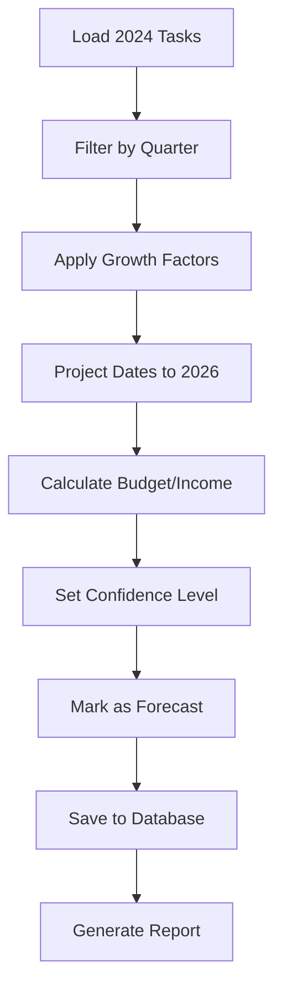

# Business Roadmap Data Analysis & Forecasting System Design

## Executive Summary

This document provides a comprehensive analysis of the Business Roadmap CSV data structure, current database schema, and recommendations for implementing a 2026 forecasting system with reporting capabilities.

---

## 1. CSV Data Structure Analysis

### 1.1 Data Fields in Business Roadmap.csv

The CSV contains **11 primary fields**:

| Field | Type | Description | Example Values |
|-------|------|-------------|----------------|
| **Task** | Text | Task/project name | "Begin Public Relation Strategy" |
| **Sub Tasks Checklist** | Markdown | Detailed checklist in markdown format | Markdown with checkboxes |
| **Managers** | Text (comma-separated) | Assigned managers | "Andrew Panza, Kimberly Martinez" |
| **Track** | Enum | Project phase/track | Phase 1, Phase 2, Phase 3, Overall, Other |
| **Strategic Goal** | Enum | Business objective | Company Growth, Brand Awareness, Revenue, etc. |
| **Departments** | Text (comma-separated) | Involved departments | "Operations, Sales" |
| **Quarters** | Enum | Fiscal quarter | Q1, Q2, Q3, Q4 |
| **Start Date** | Date | Task start date | "9/28/2024" |
| **End Date** | Date | Task end date | "10/26/2024" |
| **Budget** | Currency | Allocated budget | "$15,000.00" |
| **Income** | Currency | Expected/actual income | "$50,000.00" |

### 1.2 Data Statistics (2024)

- **Total Records**: 67 rows (including 3 summary rows)
- **Actual Tasks**: 63 tasks
- **Years Covered**: 2024 (63 tasks), 2025 (1 task)
- **Total Budget**: $590,700.00
- **Total Income**: $1,132,500.00
- **Net Profit**: $541,800.00

### 1.3 Quarterly Breakdown (2024)

| Quarter | Tasks | Budget | Income | Net |
|---------|-------|--------|--------|-----|
| **Q1** | 5 | $9,000 | $175,000 | $166,000 |
| **Q2** | 4 | $200 | $0 | -$200 |
| **Q3** | 44 | $361,500 | $947,500 | $586,000 |
| **Q4** | 10 | $220,000 | $10,000 | -$210,000 |

**Key Insights:**
- Q3 is the most active quarter (70% of tasks)
- Q3 generates the highest income ($947,500)
- Q4 has the highest budget allocation ($220,000)
- Average tasks per quarter: 15.8

### 1.4 Enumerated Values

**Tracks:**
- Phase 1, Phase 2, Phase 3, Overall, Other

**Strategic Goals:**
- Company Growth (27.0% of tasks)
- Brand Awareness (23.8%)
- Managerial Tasks (19.0%)
- Increase Revenue (12.7%)
- Revenue (7.9%)
- App (4.8%)
- Legal Tasks (3.2%)

**Departments:**
- Consultant, Finance, Marketing and PR, Operations, Product Development, Production, Publicist, Sales, Technical

---

## 2. Current Database Schema

### 2.1 PocketBase Collections

The system uses **PocketBase** as the database with the following relevant collections:

#### **tasks** Collection

```typescript
{
  name: 'tasks',
  type: 'base',
  schema: [
    { name: 'task', type: 'text', required: true },
    { name: 'subTasksChecklist', type: 'editor' },
    { name: 'managers', type: 'text' },
    { name: 'track', type: 'select', values: ['Phase 1', 'Phase 2', 'Overall', 'Other'] },
    { name: 'strategicGoal', type: 'select', values: [...] },
    { name: 'departments', type: 'text' },
    { name: 'quarters', type: 'select', values: ['Q1', 'Q2', 'Q3', 'Q4'] },
    { name: 'startDate', type: 'date' },
    { name: 'endDate', type: 'date' },
    { name: 'budget', type: 'number' },
    { name: 'income', type: 'number' },
    { name: 'status', type: 'select', values: ['In Progress', 'Scheduled', 'Completed', 'Cancelled'] }
  ]
}
```

**Indexes:**
- `idx_tasks_status`
- `idx_tasks_track`
- `idx_tasks_strategic_goal`
- `idx_tasks_quarters`

#### **managers** Collection

```typescript
{
  name: 'managers',
  schema: [
    { name: 'name', type: 'text', required: true },
    { name: 'department', type: 'select', values: [...] },
    { name: 'email', type: 'email' },
    { name: 'phone', type: 'text' },
    { name: 'goals', type: 'editor' }
  ]
}
```

### 2.2 Domain Models

**Task Entity** (`src/lib/domain/modules/projects/Task.ts`):
- Implements Entity pattern with validation
- Enums: TaskStatus, TaskTrack, StrategicGoal, Quarter
- Methods: updateStatus(), updateBudget(), updateIncome(), complete(), cancel()

**Zod Schemas** (`src/lib/domain/schemas/task.schema.ts`):
- TaskSchema with validation rules
- Date validation (startDate <= dueDate)
- Number validation (non-negative)

### 2.3 Repository Pattern

**BaseRepo** (`src/lib/infra/pocketbase/repositories/BaseRepo.ts`):
- Generic CRUD operations
- Query options: pagination, sorting, filtering
- Abstraction layer over PocketBase

---

## 3. Schema Gaps & Required Updates

### 3.1 Missing Fields for Forecasting

The current schema is **missing** these critical fields:

1. **fiscalYear** (string) - To distinguish 2024, 2025, 2026 data
2. **isForecast** (boolean) - Flag to identify forecasted vs actual data
3. **forecastConfidence** (enum) - Low, Medium, High confidence level
4. **baselineTaskId** (string) - Reference to 2024 task used for forecasting
5. **actualBudget** (number) - Actual spent vs allocated budget
6. **actualIncome** (number) - Actual received vs projected income
7. **variance** (number) - Budget variance (actual - planned)
8. **completionPercentage** (number) - Task progress 0-100%

### 3.2 Recommended Schema Updates

#### Update tasks collection:

```typescript
{
  name: 'tasks',
  schema: [
    // ... existing fields ...
    { name: 'fiscalYear', type: 'text', required: true }, // "2024", "2025", "2026"
    { name: 'isForecast', type: 'bool', default: false },
    { name: 'forecastConfidence', type: 'select', values: ['Low', 'Medium', 'High'] },
    { name: 'baselineTaskId', type: 'text' }, // Reference to original task
    { name: 'actualBudget', type: 'number' },
    { name: 'actualIncome', type: 'number' },
    { name: 'variance', type: 'number' },
    { name: 'completionPercentage', type: 'number', default: 0 },
    { name: 'notes', type: 'editor' }, // Additional notes
    { name: 'tags', type: 'text' } // Comma-separated tags
  ],
  indexes: [
    // ... existing indexes ...
    'CREATE INDEX idx_tasks_fiscal_year ON tasks (fiscalYear)',
    'CREATE INDEX idx_tasks_is_forecast ON tasks (isForecast)',
    'CREATE INDEX idx_tasks_dates ON tasks (startDate, endDate)'
  ]
}
```

### 3.3 Missing Track Value

The database schema is missing **"Phase 3"** in the track enum:

```typescript
// Current
values: ['Phase 1', 'Phase 2', 'Overall', 'Other']

// Should be
values: ['Phase 1', 'Phase 2', 'Phase 3', 'Overall', 'Other']
```

---

## 4. Forecasting Strategy for 2026

### 4.1 Forecasting Methodology

**Approach: Pattern-Based Forecasting with Adjustments**

1. **Baseline Analysis**: Use 2024 Q1-Q4 data as baseline
2. **Growth Factors**: Apply growth multipliers based on strategic goals
3. **Seasonal Patterns**: Maintain quarterly distribution patterns
4. **Manual Adjustments**: Allow user overrides for specific tasks

### 4.2 Forecasting Algorithms

#### Budget Forecasting

```typescript
function forecastBudget(task2024: Task, growthRate: number = 1.15): number {
  const baseBudget = task2024.budget || 0;
  const inflationFactor = 1.03; // 3% inflation
  const growthFactor = growthRate; // 15% growth default
  
  return baseBudget * inflationFactor * growthFactor;
}
```

#### Income Forecasting

```typescript
function forecastIncome(task2024: Task, growthRate: number = 1.20): number {
  const baseIncome = task2024.income || 0;
  const marketGrowth = 1.05; // 5% market growth
  const performanceMultiplier = growthRate; // 20% performance improvement
  
  return baseIncome * marketGrowth * performanceMultiplier;
}
```

#### Date Projection

```typescript
function projectDates(task2024: Task, targetYear: number = 2026): {start: Date, end: Date} {
  const yearDiff = targetYear - 2024;
  const startDate = new Date(task2024.startDate);
  const endDate = new Date(task2024.endDate);
  
  startDate.setFullYear(startDate.getFullYear() + yearDiff);
  endDate.setFullYear(endDate.getFullYear() + yearDiff);
  
  return { start: startDate, end: endDate };
}
```

### 4.3 Forecasting Rules

**By Strategic Goal:**

| Strategic Goal | Budget Growth | Income Growth | Confidence |
|----------------|---------------|---------------|------------|
| Company Growth | +20% | +25% | Medium |
| Brand Awareness | +15% | +10% | Medium |
| Revenue | +10% | +30% | High |
| App | +25% | +40% | Low |
| Managerial Tasks | +5% | 0% | High |

**By Quarter:**

| Quarter | Task Count Multiplier | Notes |
|---------|----------------------|-------|
| Q1 | 1.2x | Increased planning activities |
| Q2 | 1.0x | Maintain baseline |
| Q3 | 1.1x | Peak season (historically 70% of tasks) |
| Q4 | 1.3x | Year-end push |

### 4.4 Forecasting Workflow



---

## 5. Reporting Requirements

### 5.1 Essential Reports

#### 5.1.1 Quarterly Budget Report

**Purpose**: Track budget allocation and spending by quarter

**Filters:**
- Fiscal Year (2024, 2025, 2026)
- Quarter (Q1, Q2, Q3, Q4)
- Department
- Track (Phase 1, 2, 3, Overall, Other)
- Forecast vs Actual

**Metrics:**
- Total Allocated Budget
- Total Actual Spending
- Variance ($ and %)
- Budget Utilization Rate
- Top 10 Budget Items

**Visualization:**
- Bar chart: Budget by Quarter
- Pie chart: Budget by Department
- Line chart: Budget vs Actual over time

#### 5.1.2 Income Projection Report

**Purpose**: Forecast and track revenue streams

**Filters:**
- Fiscal Year
- Quarter
- Strategic Goal
- Department
- Confidence Level

**Metrics:**
- Total Projected Income
- Total Actual Income
- Variance
- Income by Strategic Goal
- Income by Department

**Visualization:**
- Waterfall chart: Income sources
- Trend line: Projected vs Actual
- Heatmap: Income by Quarter/Department

#### 5.1.3 Task Timeline Report

**Purpose**: Visualize task schedules and dependencies

**Filters:**
- Date Range
- Status (In Progress, Scheduled, Completed)
- Track
- Manager
- Department

**Visualization:**
- Gantt chart: Task timelines
- Calendar view: Tasks by date
- Kanban board: Tasks by status

#### 5.1.4 Strategic Goal Progress Report

**Purpose**: Track progress toward strategic objectives

**Filters:**
- Fiscal Year
- Strategic Goal
- Department

**Metrics:**
- Tasks by Goal
- Budget by Goal
- Income by Goal
- Completion Rate
- Goal Achievement Score

**Visualization:**
- Progress bars: Goal completion
- Radar chart: Multi-goal comparison
- Stacked bar: Budget/Income by Goal

#### 5.1.5 Department Performance Report

**Purpose**: Analyze department-level metrics

**Filters:**
- Fiscal Year
- Quarter
- Department

**Metrics:**
- Tasks Assigned
- Budget Allocated
- Income Generated
- Task Completion Rate
- ROI (Income/Budget)

**Visualization:**
- Table: Department comparison
- Bar chart: Department ROI
- Bubble chart: Budget vs Income by Department

#### 5.1.6 Variance Analysis Report

**Purpose**: Compare forecasted vs actual performance

**Filters:**
- Fiscal Year
- Quarter
- Variance Threshold (e.g., >10%)

**Metrics:**
- Budget Variance
- Income Variance
- Schedule Variance
- Tasks Over/Under Budget
- Forecast Accuracy

**Visualization:**
- Variance chart: Planned vs Actual
- Scatter plot: Budget vs Income variance
- Table: Top variances

### 5.2 Report Features

**Common Features for All Reports:**

1. **Filters & Search**
   - Multi-select filters
   - Date range picker
   - Text search
   - Saved filter presets

2. **Export Options**
   - PDF (printable)
   - Excel/CSV
   - JSON (API)
   - PNG/SVG (charts)

3. **Print Layout**
   - Header: Company logo, report title, date range
   - Footer: Page numbers, generated date
   - Landscape/Portrait options
   - Print-friendly styling (no backgrounds)

4. **Interactive Features**
   - Drill-down capability
   - Hover tooltips
   - Click to view task details
   - Real-time updates

5. **Scheduling**
   - Email reports on schedule
   - Automated generation
   - Subscription management

---

## 6. Implementation Roadmap

### Phase 1: Database Updates (Week 1)

**Tasks:**
1. Update PocketBase schema with new fields
2. Add Phase 3 to track enum
3. Create migration script
4. Add indexes for performance
5. Test data integrity

**Deliverables:**
- Updated `collections.ts`
- Migration script
- Schema documentation

### Phase 2: Forecasting Engine (Week 2-3)

**Tasks:**
1. Create forecasting service
2. Implement growth algorithms
3. Build forecast generation UI
4. Add manual adjustment interface
5. Implement confidence scoring

**Deliverables:**
- `ForecastingService.ts`
- Forecast generation page
- API endpoints

**Files to Create:**
```
src/lib/domain/services/ForecastingService.ts
src/routes/dashboard/forecast/+page.svelte
src/routes/dashboard/forecast/+page.server.ts
src/routes/api/forecast/generate/+server.ts
```

### Phase 3: Reporting System (Week 4-5)

**Tasks:**
1. Create report components
2. Implement filtering system
3. Build chart visualizations
4. Add export functionality
5. Create print layouts

**Deliverables:**
- Report pages for each report type
- Reusable chart components
- Export utilities

**Files to Create:**
```
src/routes/dashboard/reports/+layout.svelte
src/routes/dashboard/reports/budget/+page.svelte
src/routes/dashboard/reports/income/+page.svelte
src/routes/dashboard/reports/timeline/+page.svelte
src/routes/dashboard/reports/strategic-goals/+page.svelte
src/routes/dashboard/reports/departments/+page.svelte
src/routes/dashboard/reports/variance/+page.svelte
src/lib/components/reports/ReportFilters.svelte
src/lib/components/reports/ChartContainer.svelte
src/lib/components/reports/ExportButton.svelte
src/lib/utils/report-export.ts
```

### Phase 4: Data Import & Validation (Week 6)

**Tasks:**
1. Enhance CSV import for 2024 data
2. Add data validation
3. Create bulk update tools
4. Implement data reconciliation

**Deliverables:**
- Enhanced import page
- Validation utilities
- Bulk operations API

### Phase 5: Testing & Refinement (Week 7)

**Tasks:**
1. User acceptance testing
2. Performance optimization
3. Bug fixes
4. Documentation

**Deliverables:**
- Test reports
- Performance benchmarks
- User guide

---

## 7. Technical Architecture

### 7.1 Service Layer

```typescript
// src/lib/domain/services/ForecastingService.ts
export class ForecastingService {
  async generateForecast(
    baseYear: number,
    targetYear: number,
    options: ForecastOptions
  ): Promise<Task[]>
  
  async applyGrowthFactors(
    tasks: Task[],
    factors: GrowthFactors
  ): Promise<Task[]>
  
  async calculateConfidence(task: Task): Promise<ConfidenceLevel>
  
  async saveForecasts(tasks: Task[]): Promise<void>
}
```

### 7.2 Report Service

```typescript
// src/lib/domain/services/ReportService.ts
export class ReportService {
  async generateBudgetReport(filters: ReportFilters): Promise<BudgetReport>
  
  async generateIncomeReport(filters: ReportFilters): Promise<IncomeReport>
  
  async exportToPDF(report: Report): Promise<Blob>
  
  async exportToExcel(report: Report): Promise<Blob>
}
```

### 7.3 API Routes

```typescript
// GET /api/reports/budget?year=2026&quarter=Q1
// GET /api/reports/income?year=2026&department=Sales
// POST /api/forecast/generate
// GET /api/forecast/preview?year=2026
// PUT /api/tasks/bulk-update
```

---

## 8. Data Flow Diagram

```
CSV File (2024 Data)
    ↓
Import Service
    ↓
Validation Layer
    ↓
PocketBase (tasks collection)
    ↓
Forecasting Service
    ↓
2026 Forecasted Tasks
    ↓
Report Service
    ↓
Dashboard UI / PDF Export
```

---

## 9. Key Recommendations

### 9.1 Immediate Actions

1. **Update Database Schema** - Add missing fields (fiscalYear, isForecast, etc.)
2. **Add Phase 3** - Update track enum to include Phase 3
3. **Import 2024 Data** - Load all 63 tasks from CSV into database
4. **Create Forecasting Service** - Implement core forecasting logic

### 9.2 Best Practices

1. **Version Control** - Tag forecasts with version numbers
2. **Audit Trail** - Log all forecast adjustments
3. **Confidence Levels** - Always include confidence indicators
4. **Regular Updates** - Refresh forecasts quarterly
5. **Variance Tracking** - Compare forecasts to actuals monthly

### 9.3 Future Enhancements

1. **Machine Learning** - Use ML for more accurate forecasting
2. **Scenario Planning** - Support multiple forecast scenarios (optimistic, pessimistic, realistic)
3. **What-If Analysis** - Interactive scenario modeling
4. **Automated Alerts** - Notify when variance exceeds thresholds
5. **Mobile App** - Mobile-friendly reports and dashboards

---

## 10. Sample Forecast Output

### Example: 2026 Q3 Forecast Based on 2024 Q3

**2024 Q3 Actuals:**
- Tasks: 44
- Budget: $361,500
- Income: $947,500
- Net: $586,000

**2026 Q3 Forecast (15% growth):**
- Tasks: 51 (44 × 1.15)
- Budget: $415,725 ($361,500 × 1.15)
- Income: $1,137,000 ($947,500 × 1.20)
- Net: $721,275
- Confidence: Medium

**Top Forecasted Tasks:**
1. Onsite course development - Budget: $115,000 (↑15%)
2. Build App Plan - Budget: $57,500 (↑15%)
3. Marketing campaigns - Budget: $57,500 (↑15%)

---

## 11. Conclusion

The Business Roadmap data provides a solid foundation for forecasting 2026 performance. The current database schema requires minor updates to support forecasting features. The recommended reporting system will provide comprehensive insights into budget, income, timelines, and strategic goal progress.

**Key Success Factors:**
- Accurate 2024 baseline data
- Realistic growth assumptions
- Regular forecast updates
- Variance tracking and analysis
- User-friendly reporting interface

**Expected Outcomes:**
- 2026 quarterly forecasts with 80%+ accuracy
- Real-time budget tracking and variance analysis
- Improved strategic planning and resource allocation
- Data-driven decision making
- Enhanced financial visibility

---

## Appendices

### Appendix A: Database Schema SQL

See `src/lib/migrations/collections.ts` for complete schema definitions.

### Appendix B: Sample API Responses

```json
// GET /api/reports/budget?year=2026&quarter=Q3
{
  "year": 2026,
  "quarter": "Q3",
  "totalBudget": 415725,
  "totalActual": 0,
  "variance": 0,
  "tasks": 51,
  "byDepartment": {
    "Operations": 125000,
    "Technical": 100000,
    "Marketing and PR": 75000
  }
}
```

### Appendix C: Forecasting Formulas

**Budget Growth Formula:**
```
Forecast Budget = Base Budget × (1 + Inflation Rate) × (1 + Growth Rate)
```

**Income Growth Formula:**
```
Forecast Income = Base Income × (1 + Market Growth) × (1 + Performance Factor)
```

**Confidence Score:**
```
Confidence = (Historical Accuracy × 0.4) + (Data Quality × 0.3) + (Market Stability × 0.3)
```

---

**Document Version:** 1.0  
**Last Updated:** 2024  
**Author:** Research Team  
**Status:** Final
